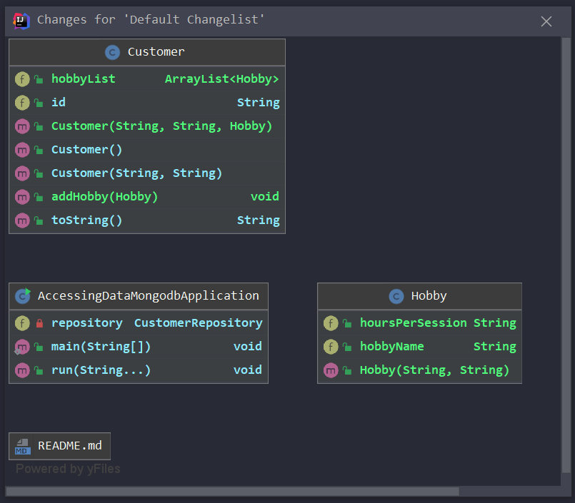

# accessing-data-mongodb

https://spring.io/guides/gs/accessing-data-mongodb/

This spring project accesses a MongoDB "Customer" collection on the local test table.

## Change Log

### 2021-06-03



MongoDB Collection

```json
{ 
    "_id" : ObjectId("60b836c78fd7835512f07c22"), 
    "firstName" : "Bob", 
    "lastName" : "Smith", 
    "hobbyList" : [

    ], 
    "_class" : "com.example.accessingdatamongodb.Customer"
},
{ 
    "_id" : ObjectId("60b836c78fd7835512f07c23"), 
    "firstName" : "Jia", 
    "lastName" : "Teo", 
    "hobbyList" : [
        {
            "hobbyName" : "Running", 
            "hoursPerSession" : "2"
        }
    ], 
    "_class" : "com.example.accessingdatamongodb.Customer"
}
```


## Overall diagram


## Running the project

```shell
mvnw spring-boot:run
```


