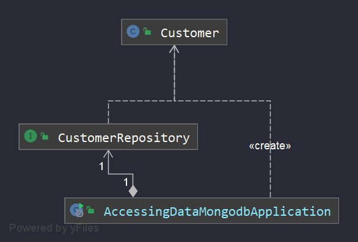

# accessing-data-mongodb

https://spring.io/guides/gs/accessing-data-mongodb/

This spring project accesses a MongoDB "Customer" collection on the local test table.

## Overall diagram



## Running the project

```shell
mvnw spring-boot:run
```


